# CRUD_Based_App

 This is a form of a social media Android application where the Create, Read, Update and Delete operations are performed on a post.
 ### Technologies Used
   - Android Studio
     - Kotlin
     - XML
   - Firebase
     - Firebase Authentication
     - Firebase Realtime Database
   
 ### Application ScreenShots:
 &nbsp;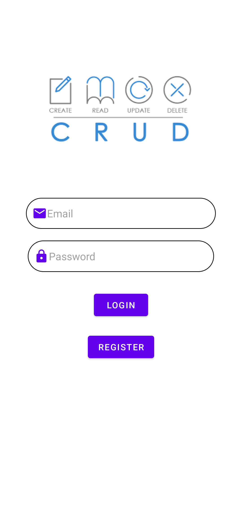&nbsp;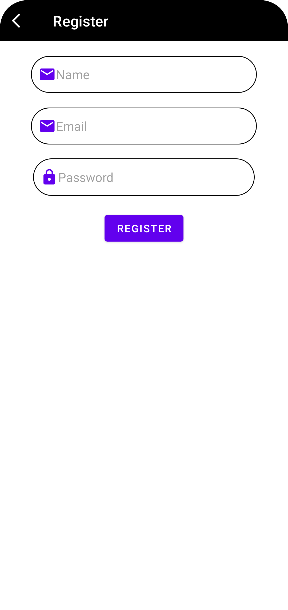&nbsp;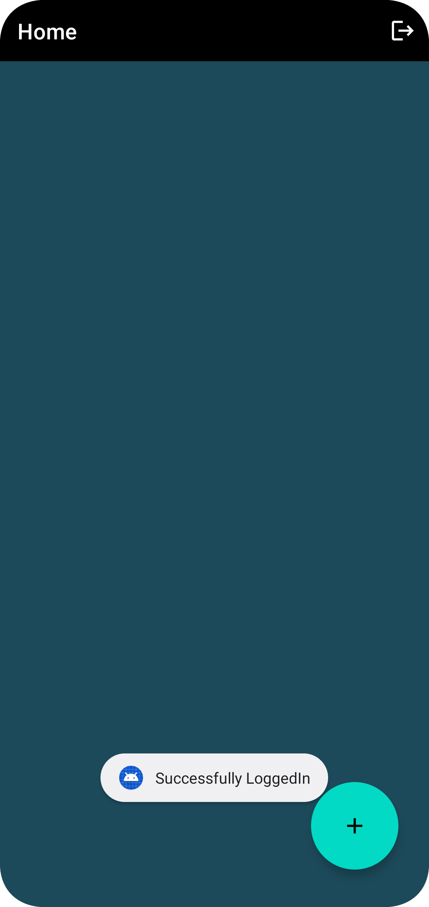&nbsp; 
 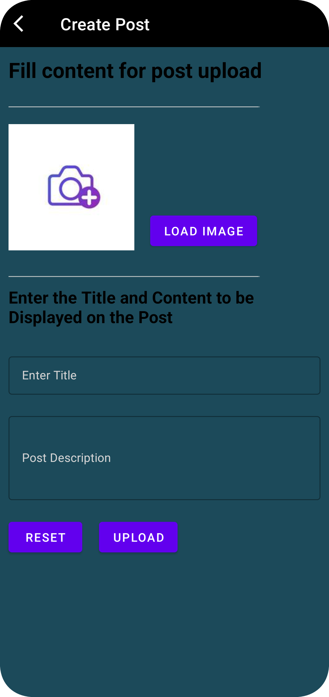&nbsp;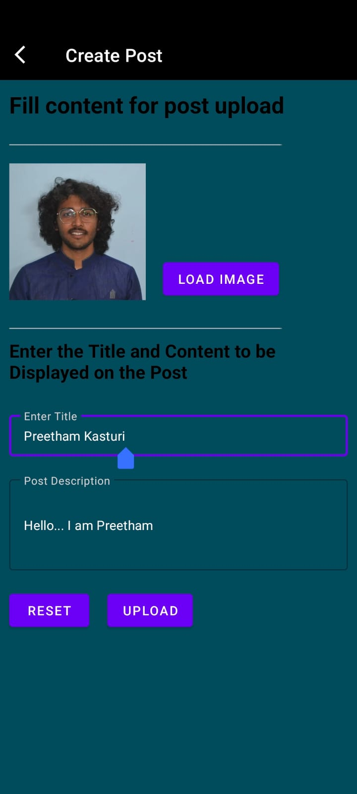&nbsp;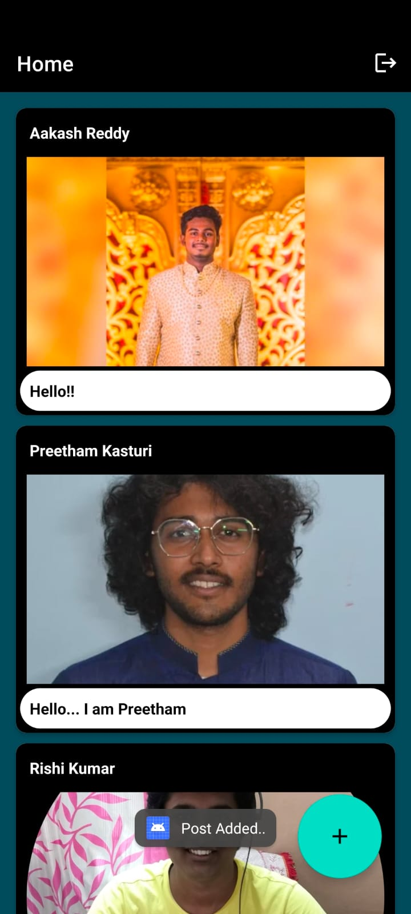&nbsp;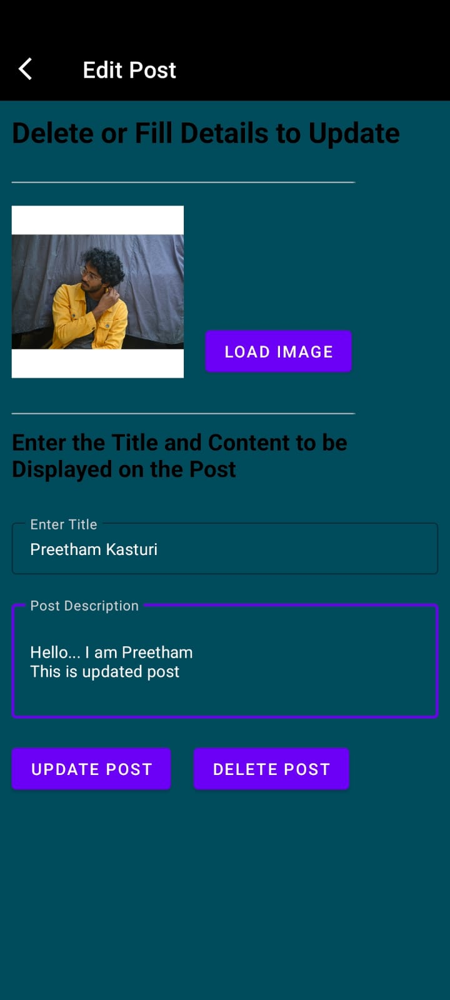&nbsp; 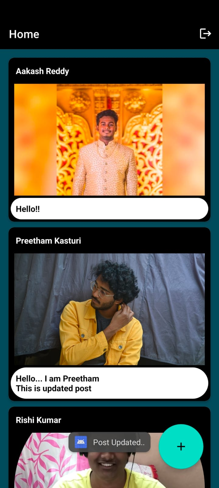&nbsp;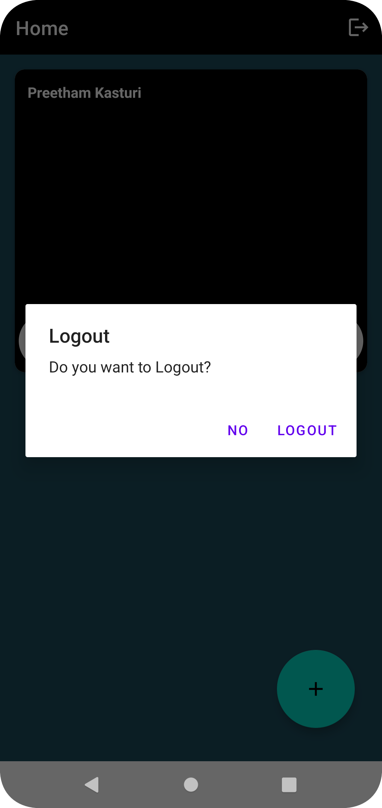
 
 ### Firebase ScreenShots:
 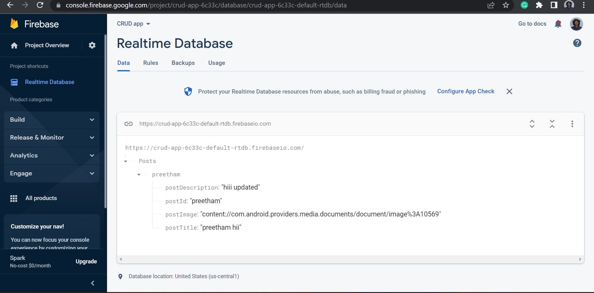&nbsp;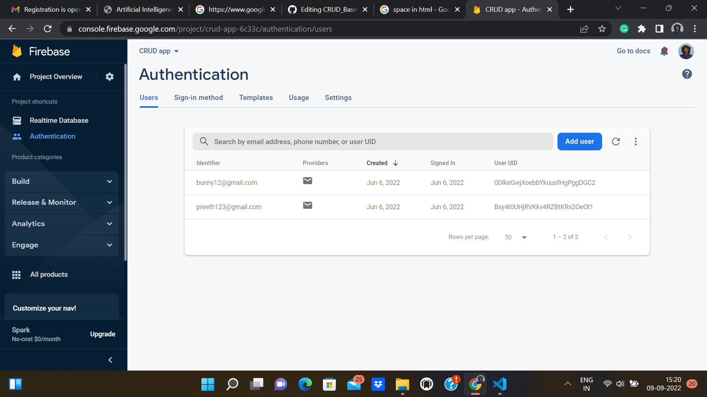
